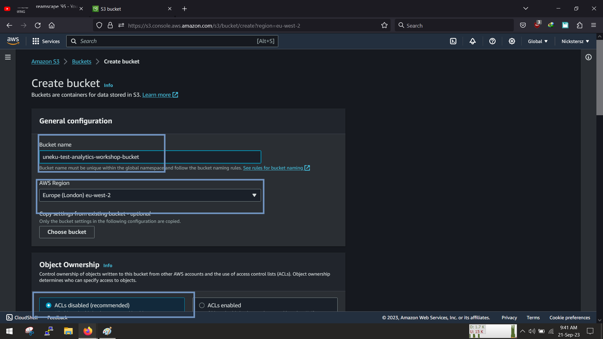
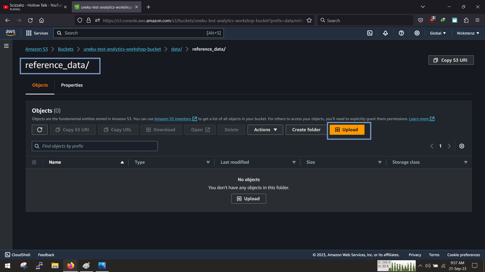
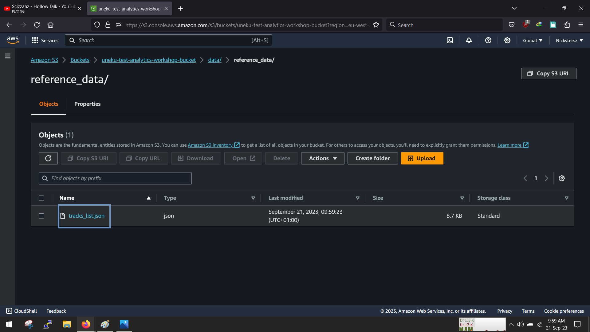

<!-- @format -->

# AthenaXAnalystics

In this project, we will setup simple analytic application, it takes a the data is generated,sorts it catalogs it and transforms it and then makes it available for Athena and quicksight to parse and display a beautiful graph.

Our Data science and data analytic friend will help us translate 😁

Here is what we are going to do

1. Create our Data Generator with cloudformation
1. Send the Data to Kinesis Firehose
1. Save the unstructred data into a bucket
1. The crawlers will pick up the data and catalog and structure them
1. Use AWS Glue studio and transform the data
1. Save the structured data into a bucket
1. Use Athena to Parse,Explore the data
1. Set up QuickSight to visualise the data

# 1. Create S3 Bucket.

We have to create S3 Bucket to store our refernce and raw data, sign in and search for S3 bucket and lets get started

Name your bucket and select your region, for this demonstration ill leave evrything and i mean everything in eu-west-2(london), as for the onwership leave it as disabled as we dont access from the outside world.

Leave the bucket versioning as disabled, leave the Server side encryption to be manage by S3, and as always dont forget to tag your resources

leave the advance settings as default for now and click create

we should have succesfully created our bucket

Now that we have our bucket, we need to upload our data, we will use a particular folder structure i.e

`S3//:<bucket-name/data/refernece_data/FileName.json>`

Enter your bucket and click create a folder,

Set the name to data, leave the rest as default and then click create

once its done, enter the data directory

Create another folder called reference_data

click create and then enter the directory

click upload and select the tracklist.json from your system and upload it

leave the rest as default and click upload

then we should have our reference data inside

Good, now we can create kinesis firehose

# 2. Create Kinesis Firehose
