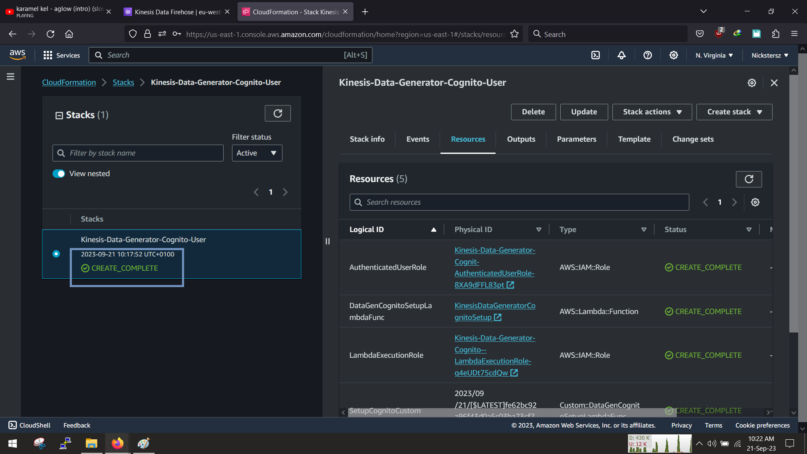

<!-- @format -->

# AthenaXAnalystics

In this project, we will setup simple analytic application, it takes a the data is generated,sorts it catalogs it and transforms it and then makes it available for Athena and quicksight to parse and display a beautiful graph.

Our Data science and data analytic friend will help us translate 😁

We will have 2 data sets to work with, one about music artists thier songs and playtime, while one is a movement activity tracker

Here is what we are going to do

1. Create our Data Generator with cloudformation
1. Send the Data to Kinesis Firehose
1. Save the unstructred data into a bucket
1. The crawlers will pick up the data and catalog and structure them
1. Use AWS Glue studio and transform the data
1. Save the structured data into a bucket
1. Use Athena to Parse,Explore the data
1. Set up QuickSight to visualise the data

# 1. Create S3 Bucket.

We have to create S3 Bucket to store our refernce and raw data, sign in and search for S3 bucket and lets get started

Name your bucket and select your region, for this demonstration ill leave evrything and i mean everything in eu-west-2(london), as for the onwership leave it as disabled as we dont access from the outside world.

Leave the bucket versioning as disabled, leave the Server side encryption to be manage by S3, and as always dont forget to tag your resources

leave the advance settings as default for now and click create

we should have succesfully created our bucket

Now that we have our bucket, we need to upload our data, we will use a particular folder structure i.e

`S3//:<bucket-name/data/refernece_data/FileName.json>`

Enter your bucket and click create a folder,

Set the name to data, leave the rest as default and then click create

once its done, enter the data directory

Create another folder called reference_data

click create and then enter the directory

click upload and select the tracklist.json from your system and upload it

leave the rest as default and click upload

then we should have our reference data inside

Good, now we can create kinesis firehose

# 2. Create Kinesis Firehose

In this step we are going to create an AWS Kinesis firehose, which we will used to stream the data, while in your console search for kinesis firehose and click create

Set the name to your desired name, set the source to `direct PUT` and the desitination should be `Amazon S3`, Should look something like this

under the desitnation settings, we need to input the full S3 URL, we will not be doing any partitioning so leave as `Not Enabled`. the next line is the bucker prefix, this must be named as `data/raw/` (dont forget the `/` at the end)

At the S3 Buffer hints, we are going to reduce the buffer size to 1MB and set the interval to 60seconds, leave the compression as not enabled...we dont want our files to be saved as zip file!

Under the Advanced tabs, leaeve server side encryption unchecked - [] , Enable cloud watch logs to store logs for us very useful incase of errors, we will the service to create the IAM role that it needs as an entity and as usual dont forget to tag the resources and click create

we should have our fireshose ready to recieve and send data

# 3. Generate our Data

Now we can generate our data, Here is a link to a [Cloudformation Template](https://us-east-1.console.aws.amazon.com/cloudformation/home?region=us-east-1#/stacks/new?stackName=Kinesis-Data-Generator-Cognito-User&templateURL=https://aws-kdg-tools-us-east-1.s3.amazonaws.com/cognito-setup.json) that we can use to spin up an AWS Kinesis data generator that we can use to stream the data to Kineses firehose, the cloudformation templates sets up a serveless incognito pool for user authentication, lamba and its IAM policies and will also generates a url to visit the site

You can leave the 1st step as default and click next

in the next step, you will input a username and passowrd, Remember those details as you will use it and sign up when the site is up

in the next step dont forget to tag your resource and also leave the iam section blank, cloudformation will automatically set that up for us, click next

scroll down abit and set the stack failure options to `roll back`, incase theres a failure.. it will delete whatever was created, leave the remaining options as default

finally click and agree to the terms giving cloudformation permission to provision the requied resources and then click submit

It takes about 3-5mins to create, so you watch it create.

Once creation is complete we can procced

click on the outputs section and open the url in your browser

Login with the detail we earlier created when we were setting up cloudformation, the site should look like this ->

When you have logged in, ensure to set the parameters to match the location of your resources, in this tutorial i chose to do everything in the eu-west-2(london) region, so ill change the regions to london and select the firehose that was created
fill in the template section with the data in `/src/templatedata.json
`

You can click send data and watch the data streaming to your firehose, once you get about 10,000 messages you can stop it

then you can check the s3 bucket to ensure that the data has arrived

